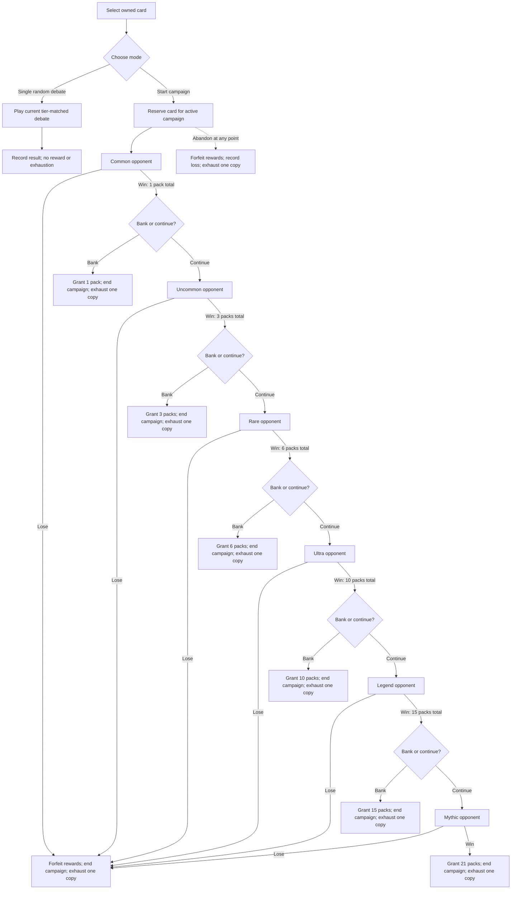

# Debate Mode

Single-player-vs-AI Debate mode built on card `atk`/`def`/`ovr` stats.
The five-turn polling duel and Campaign mode are wired in the product.
Campaign progression, exact-rarity matchmaking, interruption recovery,
validated persistence, exhaustion, statistics, atomic reward commits, and
localized campaign UI are implemented. No votation/initiative data is used.

Model checks use Node's built-in test runner via `npm run verify:debate`;
the production-rule simulation runs via `npm run simulate:debate`.

## Legacy history

The removed v1 mode resolved one Attack/Defend choice as sudden death. Its
browser-only `bundeshaus-battle-v1` records remain untouched because those wins
cannot be truthfully classified as Debate majority or turn-limit wins. No v1
resolver or product route remains.

## Current implementation — Debate polling duel

**Status: implemented and verified.** The picker uses tier-matched,
cross-party-preferred matchmaking, the AI weights actions by card stats, and
each Debate runs for up to five turns.

### Concept

Debate is an abstract card-game simulation, not a representation of any
portrayed person's political opinions, positions, or statements. Feedback
copy must describe only card stats, chosen actions, poll movement, and game
rules.

Instead of one coin-flip, a Debate runs over a simulated public
opinion poll across up to **5 turns**. A pool of 100 points is split into
five buckets:

```text
Firm (mine) | Rather (mine) | Undecided | Rather (opponent) | Firm (opponent)
```

Voters only ever move one-way, same-side: `Undecided → Rather(mine)` or
`Rather(mine) → Firm(mine)`. They **never** flip straight from one side to
the other, and Firm/Undecided are one-way destinations.

### Turn actions & outcome table

Every turn compares the relevant stat(s) for the two chosen actions. The
rule is symmetric and independent of who's the player vs. the AI: **the
higher-value side of any comparison always pulls something new out of
Undecided; the lower side never does.** Defend is the only action that can
be a true no-op (a loss on Defend/Defend gains nothing); Attack always
touches Undecided in some way, win, lose, or tie.

| # | Actions | Comparison | Result | Effect |
|---|---------|-----------|--------|--------|
| 1 | Defend/Defend | DEF(A) vs DEF(B) | A higher | Both secure own Rather→Firm (own DEF, as always) **+** A trickles `Undecided → Rather(A)`, sized by the DEF margin. |
| 2 | Defend/Defend | DEF(A) vs DEF(B) | tie | Both secure own Rather→Firm (own DEF). No Undecided movement. |
| 3 | Defend/Defend | DEF(A) vs DEF(B) | B higher | Mirror of #1. |
| 4 | Attack/Defend | ATK(attacker) vs DEF(defender) | attacker higher | Destabilize `Rather(defender) → Undecided` **+** recruit `Undecided → Rather(attacker)`, both sized by the margin. Defender still secures whatever Rather survives via their own DEF. |
| 5 | Attack/Defend | ATK(attacker) vs DEF(defender) | tie | No destabilize, but attacker still recruits a small flat `Undecided → Rather(attacker)` (ATK-based, not margin-based). Defender secures normally. |
| 6 | Attack/Defend | ATK(attacker) vs DEF(defender) | defender higher | Attack repelled. Defender gets a bonus secure (`Rather(defender) → Firm(defender)`, margin-sized) **+** attacker suffers backlash (`Rather(attacker) → Undecided`, margin-sized). |
| 7 | Attack/Attack | ATK(A) vs ATK(B) | A higher | Proportional recruit split favoring A, sized by own ATK (scarcity-aware, see formula). |
| 8 | Attack/Attack | ATK(A) vs ATK(B) | tie | Even 50/50 recruit split of whatever Undecided demand is satisfiable. |
| 9 | Attack/Attack | ATK(A) vs ATK(B) | B higher | Mirror of #7. |

All deltas for a turn are computed from the same pre-turn snapshot and
applied atomically, with one deliberate exception: within a single
Attack/Defend cell, the attacker's effect ("first move") resolves against
the pre-turn `Rather(defender)`, and the defender's own baseline secure
then resolves against whatever remains — the attack lands first, then the
defender rallies with what's left. Every margin-based amount is floored at
1 once the margin is `> 0` (still capped by the available pool), so a won
comparison always has *some* visible effect — the "nothing happens" case is
now reserved for actual ties only.

### Formulas (`K = 4`, a tunable constant; recommended starting point)

```ts
const amt = (margin: number, pool: number) =>
  margin > 0 ? min(pool, max(1, round(margin / K))) : 0

// Defend vs Defend — baseline secure always applies, independent of comparison
secureAmount_A = min(ratherA, round(DEF_A / K))
secureAmount_B = min(ratherB, round(DEF_B / K))
// higher DEF additionally trickles Undecided -> own Rather; the lower side gets nothing
defMargin = DEF_A - DEF_B
if (defMargin !== 0) {
  winner = defMargin > 0 ? 'A' : 'B'
  trickle = min(undecided, round(amt(abs(defMargin), undecided) * 1.5))
  rather[winner] += trickle; undecided -= trickle
}

// Attack vs Defend — attacker's branch resolves first (pre-turn snapshot),
// defender's baseline secure resolves second, against the remainder
margin = ATK_attacker - DEF_defender
undecidedBefore = undecided
if (margin > 0) {                                                  // row 4: attacker wins
  destabilize = amt(margin, ratherDefender)                         // Rather(defender) -> Undecided
  recruit = amt(margin, undecided)                                  // Undecided -> Rather(attacker), pre-turn undecided
  ratherDefender -= destabilize; ratherAttacker += recruit
  undecided += destabilize - recruit
} else if (margin === 0) {                                          // row 5: stalemate
  recruit = min(undecided, max(1, round(ATK_attacker / (K * 2))))    // smaller flat pull, no destabilize
  undecided -= recruit; ratherAttacker += recruit
} else {                                                             // row 6: defender wins
  secureBonus = amt(-margin, ratherDefender)                         // extra Rather(defender) -> Firm(defender), first
  ratherDefender -= secureBonus; firmDefender += secureBonus
  backlash = amt(-margin, ratherAttacker)                            // Rather(attacker) -> Undecided
  ratherAttacker -= backlash; undecided += backlash
  recruit = min(undecidedBefore, amt(-margin, undecidedBefore))      // normal-strength Undecided -> Rather(defender)
  undecided -= recruit; ratherDefender += recruit
}
// defender's baseline secure (own DEF) applies last, against whatever Rather(defender) remains
baselineSecure = min(ratherDefender, round(DEF_defender / K))
ratherDefender -= baselineSecure; firmDefender += baselineSecure

// Attack vs Attack (rows 7-9, recruiting race, scarcity-aware)
desiredMine = round(ATK_mine / K); desiredOpp = round(ATK_opp / K)
if (desiredMine + desiredOpp === 0) {
  recruitMine = 0; recruitOpp = 0                                   // defensive guard, unreachable with real stat ranges
} else if (desiredMine + desiredOpp <= undecided) {
  recruitMine = desiredMine; recruitOpp = desiredOpp
} else {
  exactMine = undecided * desiredMine / (desiredMine + desiredOpp)
  exactOpp = undecided * desiredOpp / (desiredMine + desiredOpp)
  recruitMine = floor(exactMine); recruitOpp = floor(exactOpp)
  // Give an indivisible remainder to the larger fractional share. If both
  // shares are exact halves, compare OVR, then use an injectable coin flip.
  assignRemainderByFractionThenOvrThenCoinFlip()
}
```

**Edge cases, resolved:**
- Rows 4/6: the attacker's branch resolves against the pre-turn Rather
  pool; the defender's baseline secure resolves second, against the
  remainder — the two can never together over-draw the pool.
- Every margin-based amount floors at 1 (not 0) once the margin is `> 0`,
  so winning a comparison is never invisible — reserved for true ties.
- Case 6's defender recruit uses `undecidedBefore`, so the backlash and recruit
  are both based on the same pre-turn snapshot; the recruit cannot amplify
  itself from the backlash.
- `desiredMine + desiredOpp === 0` can't happen with real stats (min ATK 45
  vs. `K = 4` needs ATK < 3 to floor to 0) — the guard exists only for
  future retuning or debuffed-stat content, not a live concern.
- Scarce Attack/Attack recruitment allocates indivisible points by fractional
  share, then OVR, then a coin flip. This avoids a player-slot rounding bias.
- A side's Rather pool hitting 0 (fully converted to Firm) makes that side
  permanently immune to further destabilize/backlash — intentional, the
  payoff for consistent defending.
- Once Undecided hits 0, the remaining 100 points are entirely Firm+Rather
  split between the two sides, so one side already has a majority (the
  existing win condition fires) unless it's an exact 50/50 split — no
  separate handling needed.

With real stat ranges (ATK/DEF 45–97, avg ~71), one action moves roughly
8–16 points — meaningful within 5 turns, not a one-shot blowout. The
defensive tuning below increases the impact of a successful defense without
making Defend universally dominant.

### Starting distribution

`lean = min(15, round(abs(playerCard.ovr - oppCard.ovr) * 0.5))` — the
higher-OVR side starts with `lean` points in their own Rather bucket, the
rest is Undecided. Tied OVR → fully neutral start (0/0/100/0/0).

### Win conditions

1. **Majority win** (ends early): one side's `Firm + Rather` > 50.
2. **Turn-limit win** (after 5 turns, no majority): higher `Firm + Rather`
   wins. Training records it separately from a majority win, but both count as
   a campaign stage win and award the same rarity-based packs. Exact tie →
   compare `ovr`, then coin-flip.

Undecided voters count for neither side either way.

### Architecture

- `debate.ts`: pure `PollState` + `INITIAL_POLL(...)` +
  `resolveTurn(poll, playerCard, playerAction, oppCard, oppAction): PollState`
  (pure, per-turn) + `checkWin(...)`, centralized tuning and poll invariants,
  and injectable randomness for deterministic verification.
- `debateMatch.ts`: pure cross-party-preferred matchmaking and stat-weighted
  `chooseAiAction`, shared by the app and simulator.
- `debateSession.ts`: pure one-duel state machine. It owns
  `awaiting-action → actions-locked → revealing → settled` transitions and
  calls the existing poll resolver exactly once per turn.
- `useDuelSession.ts`: shared React timing adapter with suspense/result timers,
  generation-based timer cancellation, and a synchronous double-submit guard.
- `useTrainingDebate.ts`: training-only matchmaking and `DebateRecord`
  persistence.
- `useDebate.ts`: screen facade with discriminated picker, mode-choice, and
  duel views. Campaign selection is visible but disabled until its coordinator
  and persistence are implemented. Leaving the screen resets an active
  training debate.
- `debateCampaign.ts`: pure six-stage campaign progression, cumulative reward,
  bank/loss/abandon, copy-allowance, and local-midnight helpers. It is tested
  and connected to the game-state persistence gateway through
  `useDebateCampaign.ts`.
- `debateMatch.ts`: retains training matchmaking and adds exact-rarity,
  cross-party-preferred campaign matchmaking.
- `Debate.tsx`: compact persistent cards surround an animated five-bucket poll
  meter with a fixed 50/50 marker, turn indicator, neutral per-turn explanation,
  signed bucket deltas that persist until the next result, fixed action-reveal
  slots, visible opponent stats, and distinct majority versus turn-limit result
  copy.
- `storage.ts`: `DebateRecord` includes validated `majorityWins` and
  `turnLimitWins`; `wins` is persisted as their derived sum so the existing UI
  keeps its total. Debate uses a fresh `bundeshaus-battle-v2` key because v1
  sudden-death wins cannot be truthfully assigned to either category.

### Completed implementation sequence

The feature was delivered in this order so UI code never duplicated poll
arithmetic:

1. **Freeze the rules and interfaces.** Treat `K = 4`, the `1.5x` higher-DEF
   DEF/DEF trickle, and the normal-strength case-6 defender recruit as the
   initial tuning. Case-6 recruitment uses `undecidedBefore`; all other deltas
   are calculated from one pre-turn snapshot.

2. **Implement opponent selection and the pure poll model.** Update
   `pickOpponentFrom` so it first applies the rarity window and card exclusion,
   then removes the player's party if that leaves any candidates; fall back
   to the full eligible rarity pool only when necessary. Then implement the
   pure poll model in `src/game/debate.ts`. Add
   `PollState`, `PollWinner`, `INITIAL_POLL(playerCard, oppCard)`,
   `resolveTurn(poll, playerCard, playerAction, oppCard, oppAction, options?)`,
   and `checkWin(poll, turnsPlayed, turnLimit)`. Keep `pickOpponent` and
   `chooseAiAction` unchanged apart from calling the AI once per turn.
   Centralize clamping, margin amounts, the DEF/DEF multiplier, and the case-6
   pre-turn recruit so no caller can create negative buckets or totals other
   than 100.

3. **Add model-level verification before UI work.** Use the existing
   `scripts/simulate-debate.mts` as a regression/sensitivity tool and add
   deterministic hand-check cases for: tied OVR initialization; lean in both
   directions; DEF/DEF secure plus boosted trickle; attack victory with
   destabilize/recruit; attack tie; case-6 secure/backlash/recruit using the
   pre-turn pool; Attack/Attack scarcity; early majority; five-turn winner;
   OVR tie-break; and coin-flip tie-break. Verify symmetry by mirroring every
   non-tie case. Use the dependency-free built-in `node:test` runner.

4. **Replace the one-shot hook flow in `src/game/useDebate.ts`.** Preserve the
   existing `pick → fight → reveal → result` timing and cancellation guards,
   but make `fight`/`reveal` represent one turn. Store `poll`, `turn`,
   `winner`, and the locked actions in state. On reveal, resolve exactly once,
   check for a majority, then either show the result or advance to the next
   turn. Retain the double-submit guard per turn and clear timers on reset,
   unmount, and a completed Debate.

5. **Implement the Debate UI in `src/screens/Debate.tsx`.** Replace or
   supplement the card-focused arena with five labeled buckets:
   `Firm (mine)`, `Rather (mine)`, `Undecided`, `Rather (opponent)`, and
   `Firm (opponent)`. Show `turn / 5`, keep both cards' stats visible, reveal
   actions in fixed-height poll-header slots, and provide one concise,
   politically neutral reveal explanation for each outcome row that remains
   until the next turn resolves. Copy may say “ATK exceeded DEF,”
   “defense secured support,” or “the poll remained tied,” but must not imply
   that the portrayed member said, believes, supports, or opposes anything.
   The result view must show the final split and distinguish majority wins from
   turn-limit wins. Preserve the existing empty-picker, responsive layout, and
   card persistence behavior.

6. **Update persistence after the loop works.** `DebateRecord` uses validated
   `majorityWins` and `turnLimitWins` fields while retaining
   `wins = majorityWins + turnLimitWins` for existing UI compatibility.
   Missing fields become zero and malformed or negative values are rejected
   using the established validation pattern. A fresh v2 key deliberately
   leaves unclassifiable sudden-death records in v1. No rewards or stakes are
   included.

7. **Handover verification completed.** Deterministic model cases cover
   mirrored lopsided, even, and near-tie cards, early majority, five-turn
   resolution, and exact OVR/coin ties. Browser coverage confirms suspense
   cancellation during suspense and result hold, screen unmount, synchronous
   repeated submissions, persistent
   feedback, responsive layout, and v2 record invariants. The build and lint
   pass. The seeded 100,000-trial simulation runs the production model directly,
   so simulation and gameplay cannot drift.

### Open TODOs and tuning notes

- Campaign rewards depend only on opponent rarity. Majority and turn-limit wins
  receive the same stage reward; training wins receive no reward.
- Simulation recommendation: start with `K = 4`. With stat-weighted actions
  and the frozen `1.5x`/normal-strength tuning, K = 4 produced 23.4% majority
  wins by turn 5 in the 2026-08-21 seeded 100,000-trial run; K = 6 produced
  3.9%. K = 3 was faster but risked making resolution too explosive.
- Simulation recommendation: multiply the higher-DEF DEF/DEF trickle by
  `1.5`, while keeping the case-6 defended-attack recruit at the normal
  `amt(margin, undecided)` strength. This reduced stalemate-like outcomes
  substantially without making Defend a clear winning strategy.
- Reproducible simulation: `npm run simulate:debate`. The script imports the
  production model and supports
  `DEF_TRICKLE_MULTIPLIER` and `REPELLED_TRICKLE_MULTIPLIER` for tuning.
- The training/campaign layer below uses this polling duel unchanged.

## Future: training & campaign modes (designed, not implemented)

**Status: implemented.** Mode choice, the pure campaign domain, persistence,
orchestration, and the campaign UI are wired. After the player selects a card,
Debate asks which mode to start:

- **Single random debate** preserves today's behavior exactly. It selects an
  opponent using the current matchmaking rules, records the outcome, awards
  nothing, and never exhausts the player's card. This is the training ground.
- **Campaign** uses the selected card for an escalating sequence of up to six
  debates. Opponent rarity starts at `common` and increases by one tier after
  every win. The campaign's booster packs are held until the player banks them
  or wins the final `mythic` debate.

The previously proposed duplicate wager, card-loss penalty, random card reward,
and double-or-nothing streak are superseded by this campaign design. A campaign
does not consume or risk ownership of the selected card.

### Campaign rules

1. The selected player card keeps the same stats and is used for the entire
   campaign, regardless of its own rarity.
2. The first opponent is selected randomly from `common` cards. Each subsequent
   opponent is selected randomly from the next rarity:
   `common → uncommon → rare → ultra → legend → mythic`. Within the required
   rarity, matchmaking excludes the player's card and prefers a different-party
   opponent, falling back to any other eligible card when necessary.
3. The underlying five-turn polling duel, AI behavior, and win conditions do
   not change.
4. Defeating an opponent adds that stage's packs to the campaign's unbanked
   reward. Packs are not granted to the player's inventory yet.
5. After a win from `common` through `legend`, the player chooses:
   - **Bank & end**: grant every pack accumulated in this campaign and finish.
   - **Continue**: keep the accumulated packs at risk and face the next rarity.
6. Losing any debate ends the campaign and forfeits all unbanked packs,
   including packs earned from earlier wins.
7. Winning the `mythic` debate completes the campaign and automatically grants
   all 21 accumulated packs. There is no final Bank/Continue choice.
8. One owned copy of the campaign card becomes **exhausted when the campaign
   ends** and cannot start another campaign until the next local midnight on
   the player's device. Each owned copy may enter one campaign per local day.
   While a campaign is active, it reserves one copy's daily allowance.
   Exhaustion does not prevent single random debates.
9. The player may explicitly abandon a persisted campaign. Abandoning forfeits
   all unbanked packs, records a campaign loss, ends the campaign, and exhausts
   one owned copy exactly like a debate loss.
10. Only one campaign may be active globally. The player must finish or abandon
    it before starting a campaign with any other card or copy. While it is
    active, entering Debate always resumes that campaign; single training
    debates are unavailable until the campaign ends or is abandoned.

### Rewards

The reward for a stage is based only on the defeated opponent's rarity. Rewards
accumulate linearly rather than doubling:

| Defeated rarity | Packs earned | Campaign total |
|---|---:|---:|
| Common | 1 | 1 |
| Uncommon | 2 | 3 |
| Rare | 3 | 6 |
| Ultra | 4 | 10 |
| Legend | 5 | 15 |
| Mythic | 6 | 21 |

Each awarded pack is a normal five-card booster pack using the existing
`drawPack` rules. Banking increases a persistent unopened-pack balance; cards
are not drawn until the player chooses to open those packs later through the
normal pack flow.

### Player paths



At every loss node the payout is **0**, even if the campaign previously
reached a bank offer. The possible successful exit values are therefore
**1, 3, 6, 10, 15, or 21 packs**.

### Target architecture

Training and campaigns are separate mode coordinators over one reusable duel
session. Neither mode owns poll arithmetic, and the duel session has no concept
of packs, stages, exhaustion, persistence, or training statistics.

```text
src/game/debate.ts                 pure poll rules
          │
          ▼
src/game/debateSession.ts          pure one-duel state machine
          │
          ▼
src/game/useDuelSession.ts         timers and React lifecycle
       ┌──┴───────────────┐
       ▼                  ▼
useTrainingDebate.ts      useDebateCampaign.ts
training record           campaign progression/persistence
       └──┬───────────────┘
          ▼
src/game/useDebate.ts              screen-facing facade
          ▼
src/screens/Debate.tsx             view router and composition
```

Dependencies only point downward. Pure game modules must not import React,
`localStorage`, `useGame`, or UI components. Mode coordinators may start and
observe duel sessions, but must not reproduce turn resolution.

#### 1. Poll rules: `src/game/debate.ts`

Keep the existing `PollState`, `INITIAL_POLL`, `resolveTurn`, `checkWin`, tuning
constants, and invariants unchanged. This module answers only: “given these
cards, actions, and poll, what is the next poll and has somebody won?”

It must not know whether the duel belongs to training or a campaign. Campaign
rarity, rewards, and exhaustion must never become parameters to
`resolveTurn`.

#### 2. Reusable duel session: `src/game/debateSession.ts`

Extract the per-duel transition logic currently embedded in
`useDebate.chooseAction` into a pure reducer. It owns one five-turn duel from
initial poll to settled result:

```ts
type DuelPhase =
  | 'awaiting-action'
  | 'actions-locked'
  | 'revealing'
  | 'settled'

interface DuelSession {
  phase: DuelPhase
  poll: PollState
  turn: number
  playerAction: DebateAction | null
  opponentAction: DebateAction | null
  lastTurn: CompletedDebateTurn | null
  winner: PollWinner | null
}

type DuelEvent =
  | { type: 'lock-actions'; player: DebateAction; opponent: DebateAction }
  | { type: 'reveal' }
  | { type: 'finish-reveal' }
```

- `createDuel(playerCard, opponentCard)` creates turn 1 and the initial poll.
- `reduceDuel(session, event, cards)` is the only place that sequences
  `resolveTurn` and `checkWin`.
- `reveal` resolves exactly once and always enters the visible reveal phase,
  even when that turn has produced a winner.
- `finish-reveal` runs after the existing result delay. It enters `settled` if
  there is a winner; otherwise it clears both actions and starts the next turn.
  This preserves today's pause between the poll movement and result banner.
  Invalid events return an explicit error/result rather than silently mutating
  state.
- `CompletedDebateTurn` belongs here rather than in a mode hook because both
  modes render the same feedback.

Persist IDs and scalar state, not bundled `Member` objects. A validated
`DuelSnapshot` plus `toDuelSnapshot`/`restoreDuelSnapshot` reconstructs cards
from `MEMBERS_BY_ID`. Snapshot validation checks member IDs, phase/action
consistency, turn bounds, poll total, and winner state.

Suspense and reveal timing are presentation state, not durable campaign state.
For campaign duels, persist the selected player and opponent actions
synchronously when they are locked, before starting the suspense timer. Persist
the resolved poll and winner again when `reveal` runs.

On restoration, normalize transient phases without replaying animations:

- `actions-locked` immediately dispatches `reveal` using the persisted actions;
  the AI action is never selected again.
- `revealing` immediately dispatches `finish-reveal`, entering either the next
  turn or the settled result.
- `awaiting-action` and `settled` restore directly.

Persist the normalized snapshot before accepting new input. This guarantees
that closing during suspense or reveal cannot reroll an AI action, resolve a
turn twice, or force the player to wait through an old animation.

#### 3. Duel timing adapter: `src/game/useDuelSession.ts`

This hook wraps the pure session with only browser interaction concerns:

- suspense and reveal timers;
- the synchronous action lock that prevents double submission;
- AI action selection through an injected callback;
- cancellation on unmount; and
- `start`, `restore`, `chooseAction`, and `clear` commands.

It emits `onSettled(winner, snapshot)` once, after `finish-reveal` enters the
settled phase. It does not write statistics, pick the next campaign opponent,
grant packs, or clear persisted campaigns. Both mode hooks reuse this adapter,
ensuring identical battle timing and behavior.

`clear` increments an internal session generation as well as cancelling timers.
Every delayed callback checks that generation before dispatching. Abandoning a
campaign calls `clear` before its terminal commit, so stale suspense or reveal
callbacks cannot settle an already-abandoned campaign.

Campaign mode receives an `onCheckpoint(snapshot)` callback and invokes it for
the synchronous action lock and resolved reveal transitions. Training does not
persist checkpoints. Restore normalization suppresses timers until the next
stable snapshot has been saved.

#### 4. Training coordinator: `src/game/useTrainingDebate.ts`

Training remains deliberately small:

1. Receive the selected player card.
2. Use the existing `pickOpponentFrom` tier-window matchmaking.
3. Start a shared duel session.
4. On settlement, update only `DebateRecord`.
5. Return to card selection when the player chooses another debate.

This hook owns `bundeshaus-battle-v2`, majority/turn-limit classification, and
training reset semantics. It has no imports from campaign modules and cannot
grant rewards or exhaust cards.

#### 5. Campaign domain: `src/game/debateCampaign.ts`

Keep campaign progression pure and separate from React:

```ts
type CampaignPhase = 'in-duel' | 'awaiting-choice'

interface CampaignState {
  playerId: number
  stageIndex: 0 | 1 | 2 | 3 | 4 | 5
  phase: CampaignPhase
  unbankedPacks: number
  duel: DuelSnapshot
}

type CampaignEvent =
  | { type: 'stage-settled'; winner: PollWinner }
  | { type: 'continue'; nextDuel: DuelSnapshot }
  | { type: 'bank' }
  | { type: 'abandon' }

type CampaignEffect =
  | { type: 'persist' }
  | { type: 'complete'; outcome: 'banked' | 'lost' | 'completed'; packs: number }
```

`CAMPAIGN_RARITIES`, stage pack values, cumulative totals, stage transitions,
and `nextLocalMidnight` live in this module. The reducer verifies that
`unbankedPacks` equals the total implied by `stageIndex`; callers do not pass
arbitrary reward values.

Terminal transitions produce data effects rather than calling storage or
`grantBonusPacks`. A loss or abandon produces `packs: 0`; bank and mythic
completion produce the validated accumulated total.

#### 6. Campaign coordinator: `src/game/useDebateCampaign.ts`

This hook composes the reusable duel session with the campaign reducer. It owns:

- exact-rarity opponent selection for each stage;
- restoring the single persisted campaign;
- saving a snapshot after every stable transition;
- checkpointing locked actions and resolved turns so transient animations can
  be skipped safely after interruption;
- Bank, Continue, and Abandon commands;
- campaign statistics and exhaustion effects; and
- forwarding one terminal commit to game state.

It does not update `DebateRecord`. Continuing asks the campaign matcher for the
next opponent, creates a new `DuelSnapshot`, and then dispatches `continue`.
An active campaign always wins precedence over starting another campaign.
It also wins precedence over training: the coordinator resumes its persisted
duel or choice state and exposes no command for starting a training debate.

`src/game/debateMatch.ts` retains `pickOpponentFrom` unchanged for training and
adds `pickOpponentAtRarity`. Both functions share a private
cross-party-preferred candidate helper, but their eligibility rules remain
separate and explicit.

#### 7. Screen facade: `src/game/useDebate.ts`

Keep `useDebate` as the single API consumed by the screen, but make it a facade
rather than the owner of all behavior. It composes the two mode hooks and
exposes a discriminated state:

```ts
type DebateViewState =
  | { view: 'pick'; trainingRecord: DebateRecord }
  | { view: 'choose-mode'; playerCard: Member; campaignAvailable: boolean }
  | {
      view: 'duel'
      mode: 'training' | 'campaign'
      duel: DuelViewModel
      campaign: CampaignViewModel | null
      campaignResult: CampaignResultViewModel | null
    }
  | { view: 'campaign-storage-error'; attempted: CampaignCommand }
```

The facade routes user intent to one coordinator:

- on initialization, a valid active campaign immediately determines the view;
  the picker and mode choice are unreachable;
- `pickCard` records the pending selection but starts nothing;
- `startTraining` delegates to the training coordinator only when no campaign
  is active;
- `startCampaign` delegates to the campaign coordinator;
- `chooseAction` delegates to whichever mode owns the active duel; and
- `bank`, `continueCampaign`, and `abandonCampaign` exist only in campaign
  states.

Impossible combinations should be unrepresentable. Avoid a single flat object
with nullable `mode`, `campaign`, `winner`, and `reward` fields; discriminated
states give each component exactly the data valid for its view.

The facade never retains a training selection or duel while campaign state is
active. Starting a campaign clears any pending mode-selection state before its first
snapshot is persisted. A terminal campaign commit atomically clears the
campaign; only after that commit succeeds may the facade expose a result or the
picker.

After a terminal commit succeeds, the facade derives a non-persisted
`campaign-result` view from the completed command and keeps it until dismissed.
It shows the outcome and packs granted, if any. The receipt is presentation
state only: reloading after the commit goes to the picker because the campaign
has already been cleared and all effects are durable.

#### 8. Persistence and atomic game-state commit

Campaign durability crosses packs, ownership, exhaustion, and the active
snapshot. These values should therefore live in the same persisted
`SaveState` transaction in `src/game/storage.ts`, rather than splitting the
campaign across unrelated local-storage keys:

```ts
type CampaignStageIndex = 0 | 1 | 2 | 3 | 4 | 5
type BankableRarity = Exclude<RarityKey, 'mythic'>

interface DuelSnapshot {
  version: 1
  playerId: number
  opponentId: number
  phase: DuelPhase
  poll: PollState
  turn: number
  playerAction: DebateAction | null
  opponentAction: DebateAction | null
  lastTurn: CompletedDebateTurn | null
  winner: PollWinner | null
}

interface CampaignSnapshot {
  version: 1
  id: string
  playerId: number
  stageIndex: CampaignStageIndex
  phase: CampaignPhase
  unbankedPacks: number
  duel: DuelSnapshot
}

interface DebateExhaustion {
  count: number
  resetAt: number
}

interface CampaignRecord {
  campaignsStarted: number
  campaignsBanked: number
  campaignsLost: number
  campaignsAbandoned: number
  campaignsCompleted: number
  packsAwarded: number
  stageWins: Record<RarityKey, number>
  stageLosses: Record<RarityKey, number>
  bankExits: Record<BankableRarity, number>
}

interface SaveState {
  // existing fields
  campaign: CampaignSnapshot | null
  debateExhaustion: Record<number, DebateExhaustion>
  campaignRecord: CampaignRecord
}

interface CampaignProgressCommit {
  campaignId: string
  expectedStageIndex: CampaignStageIndex
  next: CampaignSnapshot
  stageWin: RarityKey
}

interface CampaignOutcomeCommit {
  campaignId: string
  expectedStageIndex: CampaignStageIndex
  outcome: 'banked' | 'lost' | 'abandoned' | 'completed'
  stageResult: 'win' | 'loss' | null
  packs: number
}

type CampaignCommand =
  | { type: 'start'; snapshot: CampaignSnapshot }
  | { type: 'checkpoint'; snapshot: CampaignSnapshot }
  | { type: 'progress'; commit: CampaignProgressCommit }
  | { type: 'outcome'; commit: CampaignOutcomeCommit }
```

All counters are finite non-negative integers, and every applicable rarity key
is present after normalization. `campaignsLost` includes both stage losses and
explicit abandonments; `campaignsAbandoned` is the abandonment subset.
`stageLosses` counts only played duel losses. `campaignsCompleted` counts
mythic wins, while `campaignsBanked` and `bankExits` count voluntary successful
exits.

Starting a campaign and incrementing `campaignsStarted` is one save. A
non-terminal stage win and its `stageWins` increment are saved with the
`awaiting-choice` snapshot. A stage loss or mythic win records its stage result
inside the terminal commit. Statistics therefore cannot drift from resumable
campaign state.

Every progress or outcome commit must match the currently persisted campaign
ID, expected stage, and phase. A progress snapshot must retain the same player
ID. The repository revalidates pack totals and stage rarity from the active
snapshot rather than trusting command payloads. A mismatched or stale command
fails without changing state.

Campaign repository commands return an explicit result:

```ts
type CampaignWriteResult =
  | { ok: true }
  | { ok: false; error: 'storage-unavailable' }
```

`src/game/useGame.ts` exposes a narrow campaign gateway rather than the general
state setter:

```ts
interface DebateCampaignGateway {
  activeCampaign: CampaignSnapshot | null
  startCampaign(snapshot: CampaignSnapshot): CampaignWriteResult
  checkpointCampaign(snapshot: CampaignSnapshot): CampaignWriteResult
  commitCampaignProgress(commit: CampaignProgressCommit): CampaignWriteResult
  commitCampaignOutcome(commit: CampaignOutcomeCommit): CampaignWriteResult
  campaignAvailability(memberId: number): number
}
```

- `startCampaign` stores the active snapshot and increments
  `campaignsStarted`.
- `checkpointCampaign` stores locked actions or a resolved poll without
  changing statistics.
- `commitCampaignProgress` stores a non-terminal stage win and its
  `awaiting-choice` snapshot atomically.
- `commitCampaignOutcome` applies packs, terminal statistics, exhaustion, and
  campaign removal together.

`App.tsx` composes the hooks explicitly:

```ts
const game = useGame()
const debate = useDebate({ campaign: game.debateCampaign })
```

`useDebate` passes only this gateway to `useDebateCampaign`; neither
`useDebateCampaign` nor `useDuelSession` receives the complete `Game` object.
This replaces the current assumption that `useDebate()` is entirely independent
from game state while keeping the dependency narrow and testable.

`commitCampaignOutcome` performs one functional state update and one `persist`
call that simultaneously:

1. grants the validated pack count;
2. increments campaign statistics;
3. increments exhaustion for the selected member; and
4. clears the active campaign.

This single-save boundary is the idempotency mechanism: after reload, either
the active campaign still exists and no terminal effects were applied, or it is
gone and every terminal effect was applied. There is no intermediate
“payout claimed” write in another key.

The existing `grantBonusPacks` remains for achievement rewards; campaigns use
`commitCampaignOutcome` because a separate pack grant followed by campaign
cleanup is not atomic.

Campaign writes are fail-closed. Compute the candidate next state, write the
complete save first, and publish it to React state only after persistence
succeeds. Do not use the current silent `persist` behavior for campaign
checkpoints or terminal commits.

If a checkpoint or terminal commit fails:

- cancel duel timers and retain the last durable campaign state;
- retain the attempted command in memory for an explicit Retry;
- block further campaign actions until Retry succeeds or the player exits;
- show a storage error without claiming that rewards, statistics, or
  exhaustion changed; and
- on Exit, discard the pending in-memory command so the next visit restores
  the last durable snapshot.

A failed terminal commit therefore leaves the persisted campaign active and
grants no packs in memory. Retrying the same validated command is safe.

Today `persist` replaces the complete save object, and existing callers build
that object field by field. Extending `SaveState` therefore requires one shared
`toSaveState(GameState)` serializer (or equivalent repository update helper)
used by every save path, including pack completion, automatic refill, bonus
packs, trade-in, and voucher redemption. No caller may reconstruct only the
legacy fields. Add a regression test proving that every non-campaign save
operation preserves the active campaign, exhaustion, and campaign record.

Malformed campaign snapshots are discarded as a unit, never partially
restored. Corrupt data is a storage-recovery case rather than a gameplay
outcome: grant no packs, release the reservation, and do not record a loss or
exhaust a card from partially trusted fields. Existing `SaveState` values
without campaign fields receive safe defaults. `DebateRecord` remains under
`bundeshaus-battle-v2` because it is training-only.

#### 9. UI component responsibilities

`src/screens/Debate.tsx` becomes a small router over `DebateViewState`. Move
mode-specific and reusable views into `src/components/debate/` as the screen
grows:

| Component | Responsibility |
|---|---|
| `DebatePicker` | List owned cards and campaign allowances; no mode starts here. |
| `DebateModeChoice` | Explain and select Training or Campaign for one card. |
| `DebateArena` | Render cards, poll, actions, reveal, duel result, and an injected mode-specific result footer. |
| `CampaignHud` | Render stage rarity, progress, and unbanked packs around the arena. |
| `CampaignDuelFooter` | Keep the settled duel visible while rendering Bank/Continue, or a committed bank/loss/mythic result with Done. |
| `CampaignResult` | Show an outcome without a settled duel, such as abandonment. |
| `CampaignStorageError` | Block campaign input and offer Retry or Exit after a failed write. |
| `AbandonCampaignDialog` | Confirm the terminal zero-payout action. |
| `DebateStats` | Present training and campaign records without combining them. |

`DebateArena` receives a `DuelViewModel`, callbacks, and an optional result
footer; it must not inspect campaign state or call persistence. Campaign chrome
composes around the same arena rather than forking it. Campaign settlement is
still committed immediately, but the settled duel remains transiently mounted
until the player continues or dismisses the result. An `awaiting-choice`
snapshot restores that settled duel without dispatching settlement a second
time.

The current `useEffect(() => debate.reset)` in `Debate.tsx` must be removed.
Unmounting may cancel visual timers, but only the training coordinator may
discard an unpersisted training duel. Campaign state survives navigation and
resumes at its exact persisted phase.

When an active campaign exists, the screen renders only its current campaign
view plus Bank/Continue or Abandon where valid. It does not render a shortcut
to the picker or training mode. This keeps one top-level mode active at a time
and avoids parallel transient state.

#### 10. Collection, trade, achievements, and navigation

- Campaign eligibility is derived as
  `owned - exhausted - active reservation`. Exhaustion affects campaigns only.
- `useGame.executeTrade` is the enforcement boundary for reserved copies;
  `Trade.tsx` should also hide/disable them for clear feedback. Exhausted copies
  remain tradable, and exhaustion counts survive trade/reacquisition until
  midnight.
- Existing achievements observe cards only when normal packs are opened.
  Campaign payout itself is not a direct pull.
- `App.tsx` routing does not need campaign logic. Entering Debate invokes the
  facade, which exposes the persisted active campaign as the current view and
  suppresses training entry until that campaign reaches a terminal state.
- `drawPack` and the normal pack-opening components remain unchanged.

#### 11. Localization and accessibility

`src/i18n.tsx` contains all five supported language dictionaries. Add keys in
English, German, French, Italian, and Romansh for mode choice, campaign
explanations, stage progress, accumulated packs, next-stage risk, Bank,
Continue, Resume, Abandon, abandon confirmation, exhaustion and availability,
campaign results, campaign statistics, and storage-error Retry/Exit actions.

Do not embed campaign copy directly in components. Mode controls, confirmation
dialogs, disabled campaign controls, pack totals, and storage errors need
localized accessible names. Focus moves into an opened confirmation or error
dialog and returns to the invoking control when cancelled.

### State ownership summary

| State | Owner | Persisted |
|---|---|---:|
| Poll rules and turn result | `debate.ts` | No |
| Current duel phase/poll/actions | `debateSession.ts` / `useDuelSession` | Campaign only |
| Training selection and result | `useTrainingDebate` | Record only; absent during a campaign |
| Campaign stage and unbanked packs | `debateCampaign.ts` / `useDebateCampaign` | Yes |
| Completed campaign result view | `useDebate` facade | No |
| Pending failed campaign command | `useDebate` facade | No |
| Packs, exhaustion, active campaign, campaign record | `useGame` / `SaveState` | Yes |
| Current screen/view composition | `useDebate` facade | No |
| Animation timers and action lock | `useDuelSession` | No |

### Implementation sequence

1. Extract `debateSession.ts` and `useDuelSession.ts` behind today's
   `useDebate` API without changing UI or behavior.
2. Move training matchmaking and record updates into `useTrainingDebate`.
   Existing Debate tests are the regression gate for both extraction steps.
3. Replace the flat screen state with `DebateViewState` and add mode selection.
4. Implement and unit-test `debateCampaign.ts`, reward totals, eligibility, and
   exact-rarity matchmaking before adding persistence or UI.
5. Extend `SaveState` and `useGame` with campaign repository commands and the
   atomic terminal commit.
6. Add `useDebateCampaign`, exact snapshot restoration, and navigation resume.
7. Split the screen into the components above and add campaign chrome around
   the unchanged arena.
8. Add all five language dictionaries and dialog/control accessibility.
9. Update trade enforcement, campaign statistics UI, and browser coverage.

### Verification boundaries

- `debateSession` tests prove both modes resolve identical duels and reject
  invalid phase transitions.
- `debateCampaign` tests cover every stage, reward total, bank/loss/abandon
  path, mythic auto-completion, copy allowance, and local-midnight expiry.
- Storage tests cover migration defaults, malformed snapshots, exact-state
  restoration, one-save terminal commits, and preservation of campaign fields
  through every unrelated `SaveState` writer.
- Browser tests cover mode selection, arena reuse, all bank exits, campaign
  loss, abandon confirmation, duplicate-copy allowances, trade reservation,
  navigation away/back, reload during every duel phase, storage-write failure,
  keyboard/dialog focus, and each stable campaign phase.
- `scripts/simulate-debate.mts` remains unchanged because campaign mode does not
  alter AI actions, poll movement, or win resolution.
